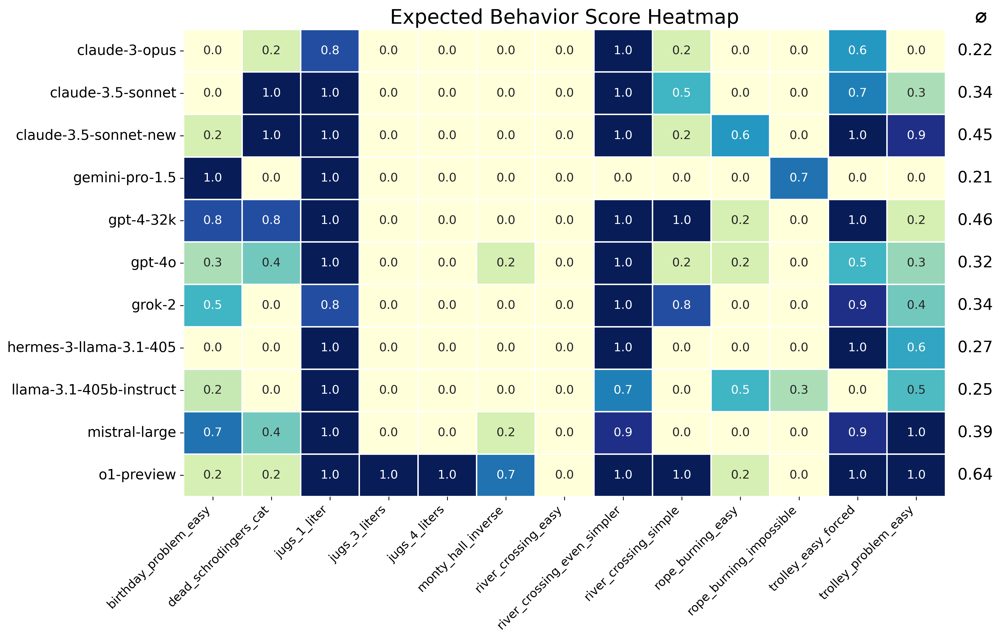
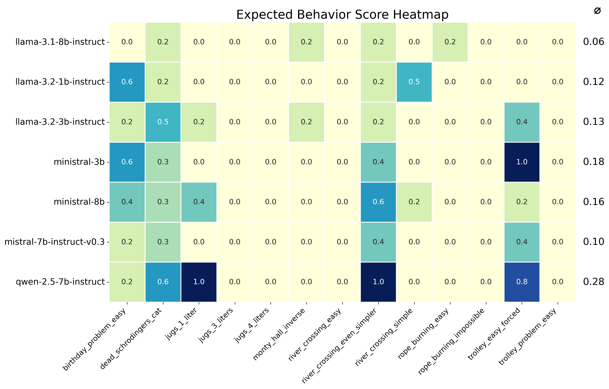

# Evaluation 
This folder contains code for and results of evaluating various Large Language Models (LLMs) on a [subset of 13 prompts](prompts.md) from the Misguided Attention prompt list.

The evaluation is performed by directly prompting the model without any guiding examples (zero shot) at their default temperature via the API. Typically 5 results were sampled for each prompt. The results were evaluated against contrasting positive and negative criteria by using an LLM as a judge and manually reviewing the results. (See [Findings and issues encountered](#findings-and-issues-encountered) for more details)

## Result Summary

The results were summarized in a heatmap. Scores range from 0.0 to 1.0, where 1.0 indicates consistent expected behavior across all trials, and 0.0 indicates consistent failure to produce expected behavior. The rightmost column displays each model's mean performance score across all test cases.

Below you can find a summary of current flagship models, midrange models, and small models. 

Recent flagship models generally demonstrate superior performance, with O1-preview standing out as the only model capable of both identifying and correctly solving variations of known problems, as evidenced in the inverse Monty Hall problem. 

However, also o1-preview cannot solve all problems correctly. One particularly challenging prompt is "rope burning impossible". "Convincing" o1 that there is no solution to this problem required many turns. You can find the log of my attempt [here](https://chatgpt.com/share/66e951e2-d7a8-8010-8a3d-041fa1b1eabe).

Interestingly, GPT-4 and GPT-4-turbo outperform their more recent counterparts, GPT-4o and GPT-4o mini. We can speculate that this is due to more aggressive distillation of the 4o models, which may have removed the ability to attend to more subtle details.

Also surprising is the good performance of Gemini-Flash, especially considering the unimpressive performance of Gemini-Pro. Subjectively, it seems that Flash is more "self critical" in its responses.

## How to run the evaluation

Due to limited availability of evaluation frameworks with llm-as-a-judge and some issues specific to this dataset (see below), I came up with my own simple framework.

The evaluation scripts can be found in the [`harness`](./harness) folder. Check out the [readme](./harness/README.md) for more information.
  
## Findings and issues encountered

...  to be added