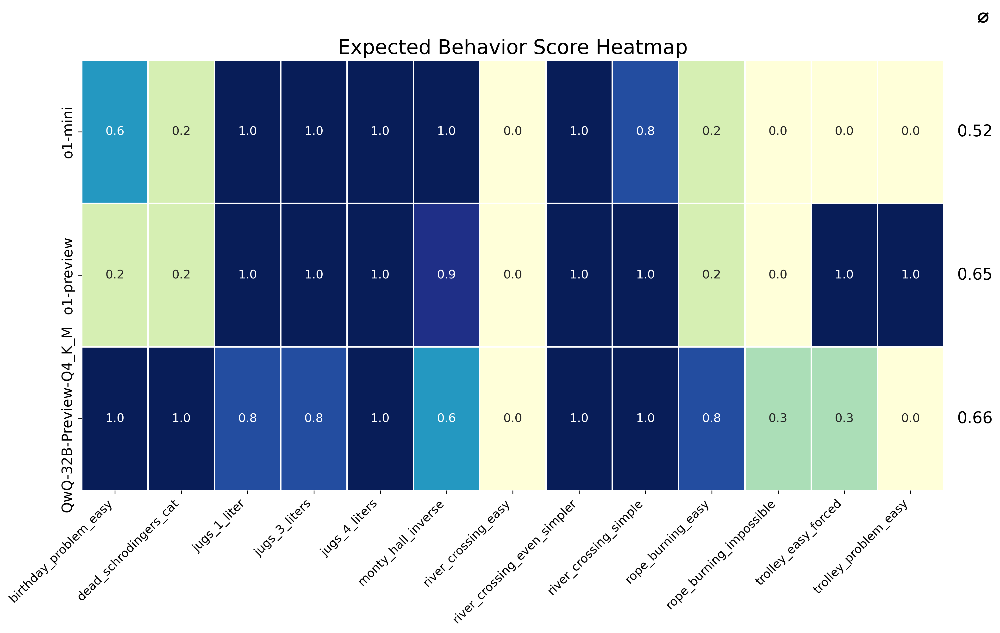

# Evaluation 
This folder contains code for and results of evaluating various Large Language Models (LLMs) on a [subset of 13 prompts](prompts.md) from the Misguided Attention prompt list.

The evaluation is performed by directly prompting the model without any guiding examples (zero shot) at their default temperature via the API. Typically 5 results were sampled for each prompt. The results were evaluated against contrasting positive and negative criteria by using an LLM as a judge and manually reviewing the results. (See [Findings and issues encountered](#findings-and-issues-encountered) for more details)

## Result Summary

The results were summarized in a heatmap. Scores range from 0.0 to 1.0, where 1.0 indicates consistent expected behavior across all trials, and 0.0 indicates consistent failure to produce expected behavior. The rightmost column displays each model's mean performance score across all test cases.

Below you can find a summary of current flagship models, midrange models, and small models. 

### Flagship models
Large models perform quite well in this benchmark, although there are some surprising outlier. The good performance of GPT-4-32k is quite remarkable and can be partially attributed to the fact that it is less prone to "list writing" than later models. The model is also speculated to be much larger than the later, distilled, derivate models like gpt-4o. The distillation process possibly removed some weaker features of the model.

"Newsonnet" is doing quite well even without a system prompt. Curiously, in [Oct 2024 Anthropic added a new paragraph to the 3.5-Sonnet system prompt](https://docs.anthropic.com/en/release-notes/system-prompts#oct-22nd-2024) that may address this eval *"If Claude is shown a familiar puzzle, it writes out the puzzle’s constraints explicitly stated in the message, quoting the human’s message to support the existence of each constraint. Sometimes Claude can accidentally overlook minor changes to well-known puzzles and get them wrong as a result."* I have to mention that using the system prompt does not improve the score too much 😀

### Midrange models
As expected, the performance of mid-range models is worse than that of the flagship models. Flash-1.5 performs well, because it seems to be finetuned to be more "skeptical" and will hence call out impossible prompts.

### Small models
Generally, small models are very sensitive to overfitting and perform badly in this benchmark. Due to smaller number of heads and lower embedding size they can focus on fewer features at a time. Qwen-2.5-72b is an exception and performs quite well.

### Reasoning models

Due to limited availability of many of these models in an API I had to manually run the evaluation in a web interface. This means that most of the models used a system prompt. (Exceptions: o1-mini, QwQ)

Reasoning models are able to iterate on the problems and inherently introduce chain-of-thought reasoning before providing an answer. This allows them to perform much better in this benchmark. However, there are still some problems that create such a strong attractor that even many iterations do not allow the models to solve the prompt correctly. 

One particularity critical corner case are problems that are impossible to solve (e.g. "rope_burning_impossible" and the "jugs_4_liters"). Most of the current generation of reasoning models is not able to identify these cases and draw the correct conclusion. One notable exception is o1 which is close to solving all prompts. This is a notable improvement over o1-preview, which still struggled with "rope_burning_impossible". [See log here](https://chatgpt.com/share/66e951e2-d7a8-8010-8a3d-041fa1b1eabe).

The exceptionally good performance of QwQ-32B-Preview is quite remarkable given its small size - I actually ran this eval locally on a RTX3090.

**Update 2024-11-16**
I reran the evaluation for Qwen-2.5-72b after noticing that it suddenly was able to solved the inverse monty hall problem, which is pretty remarkable as only o1 and o1-mini were able to solve it consistently before. The new results are included in the heatmap above and show a considerable improvement compare to the first eval of Qwen-2.5-72b  from mid of October '24. What did change? Not sure. Possibly some settings on the provider side were modified? FP8 vs FP16?

**Update 2024-12-27**
- Reasoning models were split into a separate category and folder.
- Added DeepSeek V3 evaluation results.
- Added more explanations

## How to run the evaluation

Due to limited availability of evaluation frameworks with llm-as-a-judge and some issues specific to this dataset (see below), I came up with my own simple framework.

The evaluation scripts can be found in the [`harness`](./harness) folder. Check out the [readme](./harness/README.md) for more information.
  
## Findings and issues encountered

...  to be added